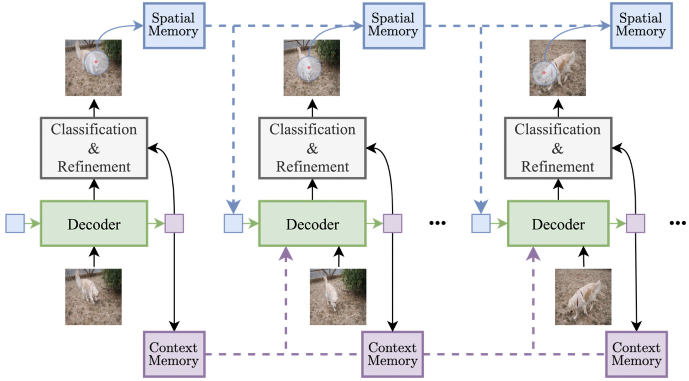

# Track-On: Transformer-based Online Point Tracking with Memory  

[**arXiv**](https://arxiv.org/abs/2501.18487) | [**Webpage**](https://kuis-ai.github.io/track_on)

This repository is the official implementation of the paper:

> **Track-On: Transformer-based Online Point Tracking with Memory**  
>
> [Görkay Aydemir](https://gorkaydemir.github.io), Xiongyi Cai, [Weidi Xie](https://weidixie.github.io), [Fatma Guney](https://mysite.ku.edu.tr/fguney/)
>
> *International Conference on Learning Representations (ICLR), 2025*  
## Overview

**Track-On** is an efficient, **online point tracking** model that tracks points in a **frame-by-frame** manner using memory. It leverages a transformer-based architecture to maintain a compact yet effective memory of previously tracked points.

<p align="center">
  
</p>

---

## Installation

### 1. Clone the repository
```bash
git clone https://github.com/gorkaydemir/track_on.git 
cd track_on
```

### 2. Set up the environment
```bash
conda create -n trackon python=3.8 -y
conda activate trackon
conda install pytorch==2.4.1 torchvision==0.19.1 torchaudio==2.4.1 pytorch-cuda=12.1 -c pytorch -c nvidia
pip install mmcv==2.2.0 -f https://download.openmmlab.com/mmcv/dist/cu121/torch2.4/index.html
pip install -r requirements.txt
```

### 3. Download Datasets  

To obtain the necessary datasets, follow the instructions provided in the [TAP-Vid repository](https://github.com/google-deepmind/tapnet/tree/main/tapnet/tapvid):  

- **Evaluation Datasets**:  
  - TAP-Vid Benchmark (DAVIS, RGB-Stacking, Kinetics)
  - Robo-TAP  

- **Training Dataset**:  
  - MOVi-F – Refer to this [GitHub issue](https://github.com/facebookresearch/co-tracker/issues/8) for additional guidance.

---

## Quick Demo

Check out the [demo notebook](demo.ipynb) for a quick start with the model.

### Usage Options
Track-On provides two practical usage modes, both handling frames online but differing in input format:

#### 1. **Frame-by-frame input (for streaming videos)**
```python
from model.track_on_ff import TrackOnFF

model = TrackOnFF(args)
model.init_queries_and_memory(queries, first_frame)

while True:
    out = model.ff_forward(new_frame)
```

#### 2. **Video input (for benchmarking)**
```python
from model.track_on import TrackOn

model = TrackOn(args)
out = model.inference(video, queries)
```

---

## Evaluation

### 1. Download Pretrained Weights
Download the pre-trained checkpoint from [Hugging Face](https://huggingface.co/gaydemir/track_on/resolve/main/track_on_checkpoint.pt?download=true).

### 2. Run Evaluation
Given:
- `evaluation_dataset`: The dataset to evaluate on
- `tapvid_root`: Path to evaluation dataset
- `checkpoint_path`: Path to the downloaded checkpoint

Run the following command:
```bash
torchrun --master_port=12345 --nproc_per_node=1 main.py \
    --eval_dataset evaluation_dataset \
    --tapvid_root /path/to/eval/data \
    --checkpoint_path /path/to/checkpoint \
    --online_validation
```
This should reproduce the exact results reported in the paper when configured correctly.

---

## Training

### 1. Prepare datasets
- **Movi-f dataset**: Located at `/root/to/movi_f`
- **TAP-Vid evaluation dataset**:
  - Dataset name: `eval_dataset`
  - Path: `/root/to/tap_vid`
- **Training name**: `training_name`

### 2. Run Training
A multi-node training script is provided in [`train.sh`](scripts/train.sh). Default training arguments are set within the script.

---

## 📖 Citation
If you find our work useful, please cite:
```bibtex
@InProceedings{Aydemir2025ICLR,
    author    = {Aydemir, G\"orkay and Cai, Xiongyi and Xie, Weidi and G\"uney, Fatma},
    title     = {{Track-On}: Transformer-based Online Point Tracking with Memory},
    booktitle = {The Thirteenth International Conference on Learning Representations},
    year      = {2025}
}
```

---

## Acknowledgments
This repository incorporates code from several public works, including [CoTracker](https://github.com/facebookresearch/co-tracker), [TAPNet](https://github.com/google-deepmind/tapnet), [DINOv2](https://github.com/facebookresearch/dinov2), [ViTAdapter](https://github.com/czczup/ViT-Adapter), and [SPINO](https://github.com/robot-learning-freiburg/SPINO). Special thanks to the authors of these projects for making their code available.

