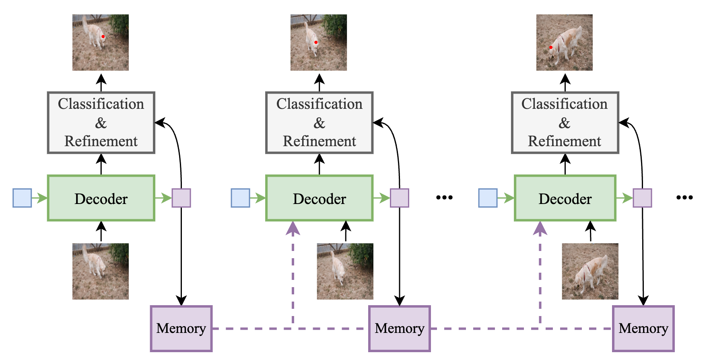

# Track-On: Online Point Tracking with Memory

### [Project Page](https://kuis-ai.github.io/track_on_r/) | [Track-On-R](https://arxiv.org/abs/2603.12217) | [Track-On2](https://arxiv.org/abs/2509.19115) | [Track-On](https://arxiv.org/abs/2501.18487) 


Official implementation of the **Track-On family of online point tracking models**.

Track-On is an **online point tracking model** that processes videos frame-by-frame using a compact transformer memory. **Track-On2** improves the architecture for stronger performance and efficiency, while **Track-On-R** further improves real-world performance through **verifier-guided pseudo-label fine-tuning**.

<p align="center">
  
</p>

<details>
<summary>Beyond the Track-On models, this repository is designed as a <b>self-contained point tracking toolkit</b>.</summary>
<br>

- 📊 **6 evaluation benchmarks** — dataloaders and a unified evaluation pipeline for [TAP-Vid DAVIS](https://tapvid.github.io), [TAP-Vid Kinetics](https://tapvid.github.io), [RoboTAP](https://robotap.github.io), [Dynamic Replica](https://dynamic-stereo.github.io), [PointOdyssey](https://pointodyssey.com), and [EgoPoints](https://ahmaddarkhalil.github.io/EgoPoints/)
- 🤝 **8 baseline trackers** — clean inference wrappers for [TAPIR](https://deepmind-tapir.github.io/), [BootsTAPIR](https://bootstap.github.io/), [TAPNext](https://tap-next.github.io/), [BootsTAPNext](https://tap-next.github.io/), [CoTracker3](https://cotracker3.github.io/), [LocoTrack](https://cvlab-kaist.github.io/locotrack/), [Anthro-LocoTrack](https://cvlab-kaist.github.io/AnthroTAP/), and [AllTracker](https://alltracker.github.io/)
- 🗂️ **Training datasets** — dataloaders for [TAP-Vid Kubric](https://tapvid.github.io) (Movi-F), [K-Epic](https://ahmaddarkhalil.github.io/EgoPoints/), and real-world video collections

</details>


---

## 🚀 Installation

### Clone the repository
```bash
git clone https://github.com/gorkaydemir/track_on.git
cd track_on
```


### Set up the environment

> **Note:** This project was trained and tested with CUDA 12.1. We recommend using the same setup for best compatibility.

Use `mamba` or `conda`:
```bash
mamba create -n track_on_r python=3.12
mamba activate track_on_r
mamba install pytorch==2.4.1 torchvision==0.19.1 torchaudio==2.4.1 pytorch-cuda=12.1 -c pytorch -c nvidia
pip install mmcv==2.2.0 -f https://download.openmmlab.com/mmcv/dist/cu121/torch2.4/index.html
pip install -r requirements.txt
```

<details>
<summary>If your GPU does not support CUDA 12.1</summary>

The prebuilt `mmcv` wheel above targets CUDA 12.1. GPUs based on newer architectures (e.g., H100) may require a higher CUDA version and will not work with the prebuilt wheel. In that case, you need to build `mmcv` from [source](https://mmcv.readthedocs.io/en/latest/get_started/build.html).

The following runtime error is a reliable sign that the prebuilt wheel is not compatible with your GPU:
```
error in ms_deformable_im2col_cuda: no kernel image is available for execution on the device
```

Build `mmcv` from source targeting your GPU's compute capability:
```bash
git clone https://github.com/open-mmlab/mmcv.git ~/mmcv
cd ~/mmcv
git checkout v2.2.0
pip install -r requirements/optional.txt
pip install "setuptools<70" --force-reinstall
MMCV_WITH_OPS=1 FORCE_CUDA=1 TORCH_CUDA_ARCH_LIST="<arch>" pip install -e . --no-build-isolation
python .dev_scripts/check_installation.py
cd ~/track_on
```
Replace `<arch>` with your GPU's compute capability:
| GPU | TORCH_CUDA_ARCH_LIST |
|-----|----------------------|
| H100 | `9.0` |
| A100 | `8.0` |
| A6000 / RTX 3090 | `8.6` |
| V100 | `7.0` |

After the source build, re-run `pip install -r requirements.txt` to restore any Track-On dependencies.

> **Note:** This setup has been tested on an H100 GPU and results were successfully reproduced. Compatibility with other architectures has not been verified.
</details>


---


## 🔑 Pretrained Models

We release the following models with DINOv3 backbone:

| Model  | Training | Download |
|------|------|------|
| Track-On-R  | Kubric + Real-world | [Link](https://huggingface.co/gorkaydemir/track_on_r/resolve/main/track_on_r.pt?download=true) |
| Track-On2 | Kubric | [Link](https://huggingface.co/gorkaydemir/track_on2/resolve/main/trackon2_dinov3_checkpoint.pt?download=true) |
| Verifier | Epic-K | [Link](https://huggingface.co/gorkaydemir/track_on_r/resolve/main/verifier.pt?download=true) |

⚠️ **Important**  
Track-On checkpoints **do not include the DINOv3 backbone weights** due to licensing restrictions.  
You must request access to the official pretrained weights for [dinov3-vits16plus](https://huggingface.co/facebook/dinov3-vits16plus-pretrain-lvd1689m) on Hugging Face.  
Once access is granted and you are logged in (`huggingface-cli login`), the weights will be automatically downloaded and cached locally on the first run.

If you want the **DINOv2 version of Track-On2**, please use the previous branch: ```track-on2```

---

## 🎬 Demo

You can track points on a video using the **`Predictor`** class.

### Minimal example
```python
import torch
from model.trackon_predictor import Predictor

device = "cuda" if torch.cuda.is_available() else "cpu"

# Initialize
model = Predictor(checkpoint_path="path/to/checkpoint.pth").to(device).eval()

# Inputs
# video:   (1, T, 3, H, W) in range 0-255
# queries: (1, N, 3) with rows = (t, x, y) in pixel coordinates
#          or use None to enable the model's uniform grid querying
video = ...          # e.g., torchvision.io.read_video -> (T, H, W, 3) -> (T, 3, H, W) -> add batch dim
queries = ...        # e.g., torch.tensor([[0, 190, 190], [0, 200, 190], ...]).unsqueeze(0).to(device)

# Inference
traj, vis = model(video, queries)

# Outputs
# traj: (1, T, N, 2)  -> per-point (x, y) in pixels
# vis:  (1, T, N)     -> per-point visibility in {0, 1}
```

### Frame-by-frame usage

In addition to full-video inference, `Predictor` supports **frame-by-frame tracking** via `forward_frame`.  
New queries can be introduced at arbitrary timesteps, and full-video inference internally relies on the same mechanism.  
This interface is intended for streaming scenarios where frames are processed sequentially.  
For a complete reference implementation of video-level tracking, please check `Predictor.forward`, which shows how frame-by-frame tracking is composed into a full pipeline.

```python
import torch
from model.trackon_predictor import Predictor

device = "cuda" if torch.cuda.is_available() else "cpu"

# Initialize
model = Predictor(checkpoint_path="path/to/checkpoint.pth").to(device).eval()
model.reset()  # reset internal memory before a new video

# video:   (1, T, 3, H, W)
# queries: (1, N, 3) with rows = (t, x, y)
video = ...
queries = ...

for t in range(video.shape[1]):
    frame = video[:, t]  # (1, 3, H, W)

    # Add queries whose start time is t
    new_queries = (
        queries[0, queries[0, :, 0] == t, 1:]
        if queries is not None else None
    )

    # Track a single frame
    points_t, vis_t = model.forward_frame(
        frame,
        new_queries=new_queries
    )

    # points_t: (N_active, 2), vis_t: (N_active,)
```

### Using `demo.py`

A ready-to-run script ([`demo.py`](demo.py)) handles loading, preprocessing, inference, and visualization.

Given:
- `--video`: Path to the input video file (e.g., `.mp4`)
- `--ckpt`: Path to the Track-On2 checkpoint (`.pth`)
- `--output`: Path to save the rendered tracking video (default: `demo_output.mp4`)
- `--use-grid`: Whether to enable a uniform grid of queries (`true` or `false`, default: `false`)
- `--config`: Optional path to model config YAML (default: built-in parameters)

you can run the demo by
```bash
python demo.py \
--video /path/to/video \
--ckpt /path/to/ckpt \
--output /path/to/output \
--use-grid true
```

Running the model with uniform grid queries on the video at `media/sample.mp4` produces the visualization shown below.

<p align="center">
  
</p>

---


## 📦 Datasets

Dataset preparation instructions are provided in 

👉 [`dataset/README.md`](dataset/README.md)

Below we summarize the datasets used in different stages of training and evaluation, together with the corresponding path variables.

- **Synthetic pretraining**  
  We use the **TAP-Vid Kubric Movi-F** split from [CoTracker3](https://github.com/facebookresearch/co-tracker).

- **Verifier training**  
  We use **K-Epic** from [EgoPoints](https://ahmaddarkhalil.github.io/EgoPoints/).

- **Real-world fine-tuning**  
  We use the [TAO](https://taodataset.org) dataset with additional videos from [OVIS](https://codalab.lisn.upsaclay.fr/competitions/4763) and [VSPW](https://github.com/VSPW-dataset/VSPW-dataset-download), all located under `rw_dataset_path`.

- **Evaluation datasets**
  - [TAP-Vid DAVIS](https://github.com/google-deepmind/tapnet/tree/main/tapnet/tapvid#downloading-tap-vid-davis-and-tap-vid-rgb-stacking)
  - [TAP-Vid Kinetics](https://github.com/google-deepmind/tapnet/tree/main/tapnet/tapvid#downloading-and-processing-tap-vid-kinetics)
  - [RoboTAP](https://github.com/google-deepmind/tapnet/tree/main/tapnet/tapvid#downloading-robotap)
  - [Dynamic Replica](https://github.com/facebookresearch/dynamic_stereo#download-the-dynamic-replica-dataset)
  - [PointOdyssey](https://github.com/y-zheng18/point_odyssey#download)
  - [EgoPoints](https://ahmaddarkhalil.github.io/EgoPoints/)

---

## 🛠️ Training

Training consists of three stages:

1. **Track-On2** – Synthetic pretraining of the tracker on TAP-Vid Kubric.
2. **Verifier** – Training the verifier on the K-Epic dataset.
3. **Track-On-R** – Real-world fine-tuning using verifier-guided pseudo-labels.

Training behavior is controlled through configuration files. These configs define the **model parameters**, **training settings**, and **dataset paths**.

In general:

- `model_save_path` specifies where the last and best checkpoints are saved.
- `checkpoint_path` can be used to resume training from a previous checkpoint.

Additional dataset and model paths required for each stage are described below.

### Pretraining (Track-On2)

Set the configuration in `config/train.yaml`:

- `movi_f_root` – Path to the TAP-Vid Kubric dataset
- `tapvid_root` – Path to the TAP-Vid DAVIS dataset (used for evaluation after each epoch)

Train the base tracker (**Track-On2**) on TAP-Vid Kubric:

```bash
torchrun --master_port=12345 --nproc_per_node=#gpus main.py \
--config_path config/train.yaml
```

### Verifier Training

During verifier training, we optionally evaluate the model after each epoch using predictions from a set of baseline trackers.

You may choose any subset of pretrained trackers for this purpose. Instructions for downloading and setting up these models are provided in: [`ensemble/README.md`](ensemble/README.md)

For example, if you want per-epoch evaluation using **Track-On2**, **BootsTAPNext**, **BootsTAPIR**, and **CoTracker3 (window)**, you need to specify the corresponding checkpoint paths.  
Note that CoTracker3 does not require an explicit checkpoint path.

If you are not interested in per-epoch evaluation, these model paths can be omitted.

<details>
<summary>[Config keys and launch command]</summary>
Set the configuration in `config/train_verifier.yaml`:

- `epic_k_path` – Path to the K-Epic dataset (train split)
- `tapvid_root` – Path to TAP-Vid DAVIS (used for evaluation after each epoch)
- `trackon2_config_path` – Track-On2 config (default: `./config/test.yaml`)
- `trackon2_checkpoint_path` – Track-On2 checkpoint
- `bootstapnext_checkpoint_path` – BootsTAPNext checkpoint
- `bootstapir_checkpoint_path` – BootsTAPIR checkpoint

Train the verifier model:

```bash
torchrun --master_port=12345 --nproc_per_node=#gpus main_verifier.py \
--config_path config/train_verifier.yaml
```
</details>

### Real-World Fine-Tuning (Track-On-R)

Real-world fine-tuning combines:

1. A **Track-On2 checkpoint** to initialize the tracker
2. A **trained verifier**
3. A set of **teacher models** whose predictions are scored by the verifier

The teacher ensemble consists of:

- Track-On2
- BootsTAPNext
- BootsTAPIR
- CoTracker3 (window)
- Anthro-LocoTrack
- AllTracker

See [`ensemble/README.md`](ensemble/README.md) for instructions on setting up these models.

Training uses both **synthetic data** and **real-world videos** by default. Synthetic data can optionally be disabled.

<details>
<summary>[Config keys and launch command]</summary>

Set the configuration in `config/train_real_world.yaml`:

- `movi_f_root` – Path to TAP-Vid Kubric (required only if `syn_real_training` is `True`)
- `tapvid_root` – Path to TAP-Vid DAVIS `.pkl` file (used for evaluation after each epoch)
- `syn_real_training` – Mix synthetic and real-world data; set to `False` for real-world only (default: `True`)
- `trackon2_config_path` – Track-On2 config used for fine-tuning (default: `./config/test.yaml`)
- `trackon2_checkpoint_path` – Track-On2 checkpoint to initialize the model
- `rw_dataset_path` – Path to the real-world dataset root (see [`dataset/README.md`](dataset/README.md))
- `bootstapnext_checkpoint_path` – BootsTAPNext checkpoint
- `bootstapir_checkpoint_path` – BootsTAPIR checkpoint
- `anthro_locotrack_checkpoint_path` – Anthro-LocoTrack checkpoint
- `alltracker_checkpoint_path` – AllTracker checkpoint
- `verifier_config_path` – Verifier config (same as the verifier training config: `./config/train_verifier.yaml`)
- `verifier_checkpoint_path` – Trained verifier checkpoint

```bash
torchrun --master_port=12345 --nproc_per_node=#gpus main_real_world_ft.py \
--config_path config/train_real_world.yaml
```

</details>

---

## ⚖️ Evaluation

You can evaluate (i) Track-On model, (ii) any teacher model, (iii) the verifier ensemble.
Detailed evaluation instructions:

👉 [`evaluation/README.md`](evaluation/README.md)

In general:

- `--dataset_name`: One of `davis`, `kinetics`, `robotap`, `point_odyssey`, `dynamic_replica`, `ego_points`
- `--dataset_path`: Path to the selected evaluation dataset
- `--model_names`: Model names to evaluate. The corresponding checkpoint path must be provided for each listed model.

Below, we show simple Track-On model, either Track-On2 or Track-On-R evaluation; and verifier with a subset of models.

### Track-On Evaluation

Evaluate Track-On on a dataset:

```bash
torchrun --master_port=12345 --nproc_per_node=1 -m evaluation.eval \
--model_names "trackon2" \
--trackon_config_path config/test.yaml \
--trackon_checkpoint_path /path/to/trackon/ckpt \
--dataset_name dataset_name \
--dataset_path path/to/dataset
```

This should reproduce the paper’s results ($\delta_{avg}^x$) when configured correctly:

| Model | DAVIS | Kinetics | RoboTAP | EgoPoints | Dynamic Replica | PointOdyssey |
| :---: | :---: | :---: | :---: | :---: | :---: | :---: |
| Track-On-R | 80.3 | 71.0 | 82.6 | 67.3 | 75.1 | 53.4 |
| Track-On2 | 79.9 | 69.3 | 80.5 | 61.7 | 74.5 | 45.1 |

### Verifier Ensemble Evaluation

<details>
<summary>[Verifier evaluation command]</summary>

Evaluate the verifier using multiple teacher tracker predictions. This will evaluate everything listed:

```bash
torchrun --master_port=12345 --nproc_per_node=1 -m evaluation.eval \
--model_names "trackon2" "bootstapnext" "bootstapir" "cotracker3_window" "anthro_locotrack" "alltracker" "verifier" \
--dataset_name dataset_name \
--dataset_path path/to/dataset \
--trackon_config_path config/test.yaml \
--trackon_checkpoint_path /path/to/trackon/ckpt \
--bootstapnext_checkpoint_path /path/to/bootstapnext/ckpt \
--bootstapir_checkpoint_path /path/to/bootstapir/ckpt \
--anthro_locotrack_checkpoint_path /path/to/anthrolocotrack/ckpt \
--alltracker_checkpoint_path /path/to/alltracker/ckpt \
--verifier_checkpoint_path /path/to/verifier/ckpt
```

Detailed evaluation instructions:

👉 [`evaluation/README.md`](evaluation/README.md)

Teacher model setup:

👉 [`ensemble/README.md`](ensemble/README.md)
</details>

### Benchmarking

Compute inference statistics (GPU memory and throughput) on DAVIS.

Given:
- `/path/to/davis`: Path to TAP-Vid DAVIS
- `/path/to/ckpt`: Path to the Track-On checkpoint
- `N_sqrt`: √(number of points) (e.g., `8` → 64 points)
- `memory_size`: Inference-time memory size

```bash
torchrun --master_port=12345 --nproc_per_node=1 -m evaluation.benchmark \
--config_path config/test.yaml \
--davis_path /path/to/davis \
--model_checkpoint_path /path/to/ckpt \
--N_sqrt N_sqrt \
--memory_size memory_size
```

---

## 📜 Previous Versions

**Track-On-R** (based on the same architecture as Track-On2) is recommended for best performance.

For convenience, earlier versions of this repository are preserved in separate branches:
- `track-on2` — code corresponding to the Track-On2 paper  
- `track-on` — original Track-On implementation (ICLR 2025)

---

## 📖 Citation

If you find this work useful, please cite:

```bibtex
@inproceedings{aydemir2026trackonr,
  title     = {Real-World Point Tracking with Verifier-Guided Pseudo-Labeling},
  author    = {Aydemir, G\"orkay and G\"uney, Fatma and Xie, Weidi},
  booktitle = {Proceedings of the IEEE/CVF Conference on Computer Vision and Pattern Recognition (CVPR)},
  year      = {2026}
}
```

```bibtex
@article{aydemir2025trackon2,
  title     = {Track-On2: Enhancing Online Point Tracking with Memory},
  author    = {Aydemir, G\"orkay and Xie, Weidi and G\"uney, Fatma},
  journal   = {arXiv preprint arXiv:2509.19115},
  year      = {2025}
}
```

```bibtex
@inproceedings{aydemir2025trackon,
  title     = {Track-On: Transformer-based Online Point Tracking with Memory},
  author    = {Aydemir, G\"orkay and Cai, Xiongyi and Xie, Weidi and G\"uney, Fatma},
  booktitle = {International Conference on Learning Representations (ICLR)},
  year      = {2025}
}
```

---

## Acknowledgments

This repository incorporates code from public works including [CoTracker](https://github.com/facebookresearch/co-tracker), [TAPNet](https://github.com/google-deepmind/tapnet), [DINOv2](https://github.com/facebookresearch/dinov2), [ViT-Adapter](https://github.com/czczup/ViT-Adapter), and [SPINO](https://github.com/robot-learning-freiburg/SPINO). We thank the authors for making their code available.